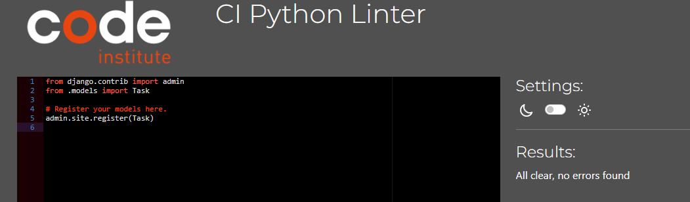
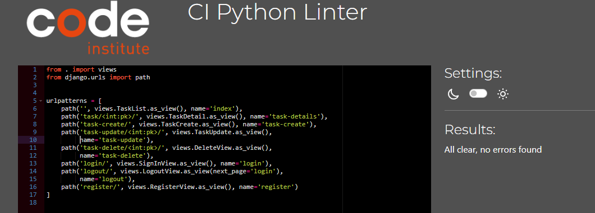
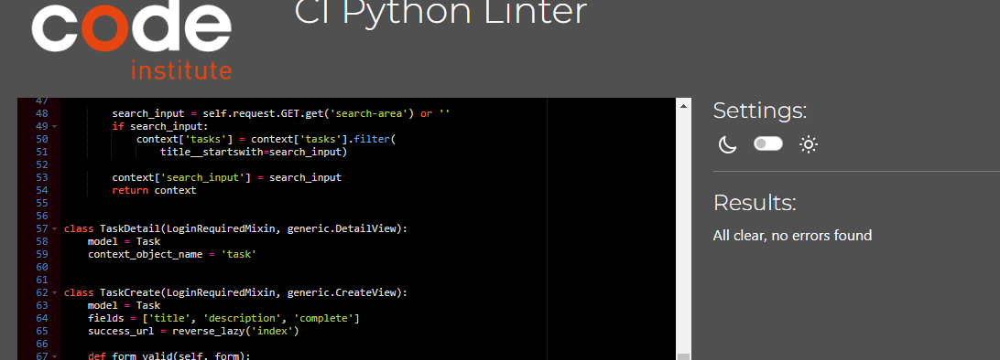
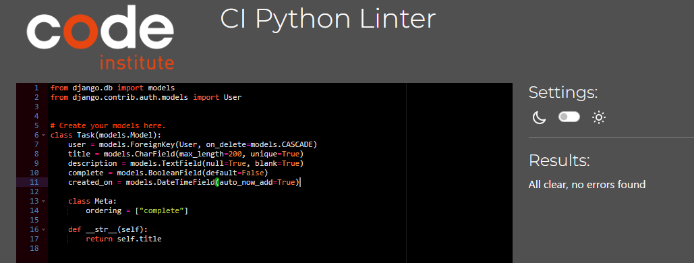
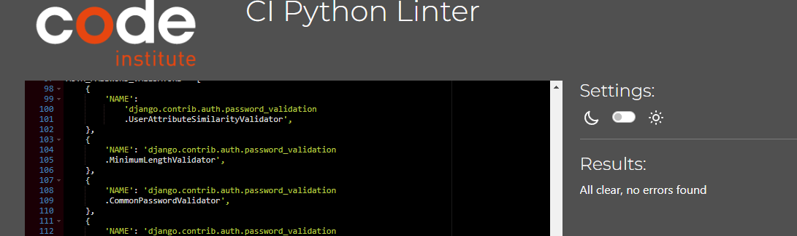
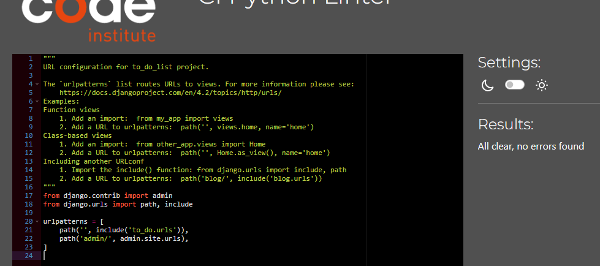

# To-Do List App
This is a To-Do List app that allows users to create their personal to-do list where they can create, view, edit, and delete tasks.

You can view the live app here - [To-Do List App](https://django-to-do-list-app-63bdab6ae456.herokuapp.com/)

# User Experience (UX)
## Target Audience
* Users who would like to organize their tasks
* Users that would like to write a list of tasks to remember

## User Stories
* A user should be able to sign in
* A user should be able to sign out
* A user should be able to add a new task
* A user should be able to search for a task
* A user should be able to register an account
* A user should be able to edit an existing task
* A user should be able to delete an existing task
* A user should be able to mark a task as completed
* A user should be able to determine how to use the app
* A user should be able to easily and intuitively navigate the app
* A user should find it easy to determine how many tasks they have left to do

## App Aims
* To allow users to write a list of tasks
* To allow users to track progress on tasks
* To allow users to mark tasks as complete when finished

# Design
## Color Scheme
The final color scheme chosen was various shades of pink
* Delete button (X) is red
* Text is black

### Typography 
The font chosen was Roboto Condensed.

# Features
The app is composed of a single model and 7 class-based views

* Sign-in form - The user will be prompted to sign in upon starting the app

* Registration form - The will allow the user to create a new account

* Sign-out link - This allows the user to sign out when signed into an account

* Homepage - This will welcome the user and display all tasks

* Search bar - This will allow the user to search for tasks

* Add task link - This takes the user to a form they must fill to add a new task

* Delete - This allows the user to delete tasks and asks the user for confirmation before deletion

* Completed task - When a task is marked as complete, the task is moved to the bottom of the list and crossed out. Also, the checkbox changes from white to pink

## Future Implementations
 I would like to add more functionality to this app to allow users to set a deadline for tasks, arrange tasks in order of importance, and share tasks and collaborate with other users.

# Technologies Used
* Python3 - Delivers the structure and content for the game
* Git - For version control
* Gitpod - Used to develop the app
* Gitbash - Terminal used to push changes to the GitHub repository
* GitHub - Used to host the app
* Heroku - Used to deploy the app
* Django - Used to develop the app rapidly
* [PostgreSQL from Code Institute](https://dbs.ci-dbs.net/) - Used to build database
* Google Dev Tools - To troubleshoot and test features, solve issues with responsiveness and styling
* [Google Fonts](https://fonts.google.com/) - Used to import the font used on the app
* [CI Python Linter](https://pep8ci.herokuapp.com/) - Used to validate code

# Deployment & Local Development
## Deployment
The app was deployed to Heroku via the following steps:
1. Log in (or sign up) to Heroku
2. Click New on the top right
3. Choose create new app
4. Choose name and region and click create app
5. In the settings tab, click on Reveal Config Vars and add the key DISABLE_COLLECTSTATIC and the value 1
6. Add another key of DATABASE_URL and set the value as the url for the database
7. Add another key of SECRET_KEY and set the value as a secret key of your choice
8. In the deploy tab, choose GitHub as deployment method and connect repository
9. In Manual deploy section, click Deploy Branch

## Local Development
### How to Fork
To fork the To-Do List repository:
1. Log in (or sign up) to Github
2. Go to the repository for this project
3. Click the Fork button in the top right corner

### How to Clone
To clone the To-Do List repository:
1. Log in (or sign up) to Github
2. Go to the repository for this project
3. Click on the code button, select whether you would like to clone with HTTPS, SSH or GitHub CLI
4. Copy the link shown
5. Open the terminal in your code editor and change the current working directory to the location you want to use for the cloned directory
6. Type 'git clone' into the terminal 
7.  Paste the link you copied in step 3
8. Press enter

# Testing
Testing was ongoing throughout the entire build. I utilized Chrome developer tools while building to pinpoint and troubleshoot any issues as I went along.

### Manual Testing
To fully test my app, I performed the following tests:
| Test                   | Action                                                          | Expected Result                                                                    | Pass/Fail |
| ---------------------- | --------------------------------------------------------------- | ---------------------------------------------------------------------------------- | --------- |
| Test sign in form      | Fill out username and password                                  | Redirect to index page                                                             | Pass      |
| Test registration form | Click register and fill out form                                | Redirect to index page                                                             | Pass      |
| Test sign out link     | Click sign out link                                             | Redirect to sign in page                                                           | Pass      |
| Test add task button   | Click on add task Fill out task details Click submit      | Redirect to index page with new task now added                                     | Pass      |
| Edit task              | Click on a task to edit Update the task Click submit      | Redirect to index page with new task now updated                                   | Pass      |
| Mark task as complete  | Click on an incomplete task Mark as complete Click submit | Redirect to index page with new task now marked as completed                       | Pass      |
| Search for a task      | Type a task into the search bar and click search                | If the task exists, all others will be filtered out and the task will be displayed | Pass      |
| Delete a task          | Click on X next to the task to be deleted Click yes          | Redirect to index page with new task now deleted                                   | Pass      |

### Code Institute Python Linter
Validation was done using [CI Python Linter](https://pep8ci.herokuapp.com/) 

admin.py

app-urls.py

views.py

model.py

settings.py

urls.py

### W3C Validator
The W3C validator was used to validate the HTML and CSS on all pages of the app. 

# Bugs
### Known Bugs
If a user knows the task id of another user's task, they are able to view and edit the task by changing the URL.

# Credits
* Django was learned from [Django Documentation](https://docs.djangoproject.com/en/5.0/)
* User authentication was learned from [Youtube](https://youtu.be/CTrVDi3tt8o?si=lLjQ6_be5Kg-AFyg)
* Fonts were sourced from [Google Fonts](https://fonts.google.com/)

# Acknowledgements
This app was designed and developed in conjunction with the Full Stack Software Developer Diploma course (ecommerce) at the Code Institute. I would like to thank my mentor, Matt, the Slack community, and Code Institute for all their support.